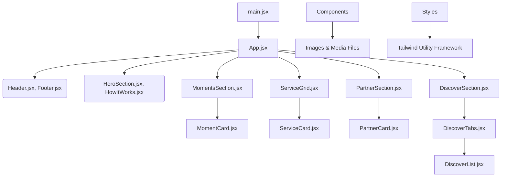

# 🍔 Foosh Landing Page

A clean, responsive, and modern landing page built with **React**, **Vite**, and **Tailwind CSS**.

---

## 📂 Project Structure

```

landing-pages
├── public                  # Static files (favicon, etc.)
├── src                     # Main application source code
│   ├── assets              # All static images and media
│   │   ├── logos
│   │   ├── moments
│   │   ├── services
│   │   ├── howitworks
│   │   ├── partners
│   │   └── discover        # Images for Discover section
│   ├── components          # Modular React components
│   │   ├── layout          # Header and Footer
│   │   ├── moments         # MomentCard & MomentsSection
│   │   ├── services        # ServiceCard & ServiceGrid
│   │   ├── partners        # PartnerCard & PartnerSection
│   │   ├── discover        # DiscoverTabs, DiscoverList & DiscoverSection
│   │   └── sections        # HeroSection, HowItWorks, etc.
│   ├── styles              # Global Tailwind and custom styles
│   ├── App.jsx             # Root app component
│   └── main.jsx            # Application entry point
├── vite.config.js          # Vite config
├── tailwind.config.js      # Tailwind CSS setup
├── postcss.config.js       # PostCSS config
├── eslint.config.js        # ESLint rules for code quality
├── package.json            # Project dependencies and scripts
└── README.md               # Documentation for the project

````

---

## 🛠️ Tech Stack

* **React** – For building UI components
* **Vite** – For fast local development
* **Tailwind CSS** – For utility-first styling

---

## 💡 Features

* Modular and clean component structure
* Fully responsive design (mobile, tablet, desktop)
* Easy to scale and customize
* Utility-first styling with Tailwind CSS (minimal custom CSS)
* Reusable UI sections: Moments, Services, Partners, Discover, and more

---

## 🚦 Getting Started

### 1. Install dependencies

```bash
npm install
````

### 2. Run the development server

```bash
npm run dev
```

### 3. Build for production

```bash
npm run build
```

---

## 📐 Architecture Diagram



---

## ✅ Best Practices

* Use Tailwind utility classes where possible.
* Structure code into clear component folders.
* Pass dynamic content using props.
* Keep UI components stateless unless necessary.
* Stick to naming conventions across all sections (e.g. `MomentCard`, `ServiceGrid`, `PartnerSection`, `DiscoverTabs`, etc.)

---

## 🚀 Contributing

1. Fork or clone this repository.
2. Create a feature branch (`feat/your-feature-name`).
3. Make your changes and commit with clear messages.
4. Submit a Pull Request for review.

---

## 🧠 Ideas for Improvement

* Add unit tests using React Testing Library.
* Integrate a CMS (like Sanity or Strapi) for dynamic content.
* Add dark mode support.
* Use React Router for multi-page navigation.

---

## 📞 Need Help?

Feel free to reach out to the frontend development team on Slack or drop an issue in the repo.
