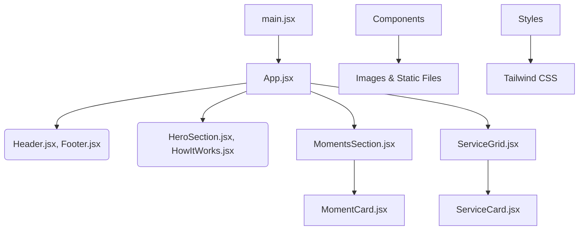

# 🍔 Foosh Landing Page

This is a simple and modern landing page built with **React**, **Vite**, and **Tailwind CSS**.

---

## 📂 Project Structure

```
landing-pages-main
├── public                  # Public files (favicon, icons, etc.)
├── src                     # Main source code
│   ├── assets              # Images and other static files
│   │   ├── logos
│   │   ├── moments
│   │   ├── services
│   │   └── howitworks
│   ├── components          # Reusable React components
│   │   ├── layout          # Header and Footer components
│   │   ├── moments         # Moment cards UI components
│   │   ├── sections        # Hero and How it Works sections
│   │   └── services        # Services UI components
│   ├── styles              # Tailwind CSS and custom styles
│   ├── App.jsx             # Main React component
│   └── main.jsx            # Entry point of the application
├── vite.config.js          # Vite configuration
├── tailwind.config.js      # Tailwind CSS configuration
├── postcss.config.js       # PostCSS configuration
├── eslint.config.js        # ESLint configuration (for code quality)
├── package.json            # Project dependencies & scripts
└── README.md               # Documentation for the project
```

---

## 🛠️ Tech Used

* **React** (JavaScript UI library)
* **Vite** (Fast build tool)
* **Tailwind CSS** (Simple and fast styling framework)

---

## 💡 Project Features

* Easy to maintain and extend components.
* Responsive design (works well on mobile and desktop).
* Clear and clean layout.

---

## 🚦 How to Run the Project

### Install Dependencies

Open your terminal and run:

```bash
npm install
```

### Run Project Locally

Start the development server:

```bash
npm run dev
```

### Build for Production

Create a production build:

```bash
npm run build
```

---

## 📐 Architecture Diagram

Here’s a simple architecture diagram showing how the project is structured:



---

## ✅ Best Practices

* Use Tailwind classes as much as possible.
* Keep components reusable and organized.
* Do not write fixed content; use dynamic props instead.

---

## 🚀 How to Contribute

* Clone this repository and create a new branch.
* Follow ESLint rules to maintain code quality.
* Submit your changes as a Pull Request.

---

## 📞 Need Help?

If you have questions, please contact the frontend development team.

---

🎉 **Enjoy building the Foosh Landing Page!**
